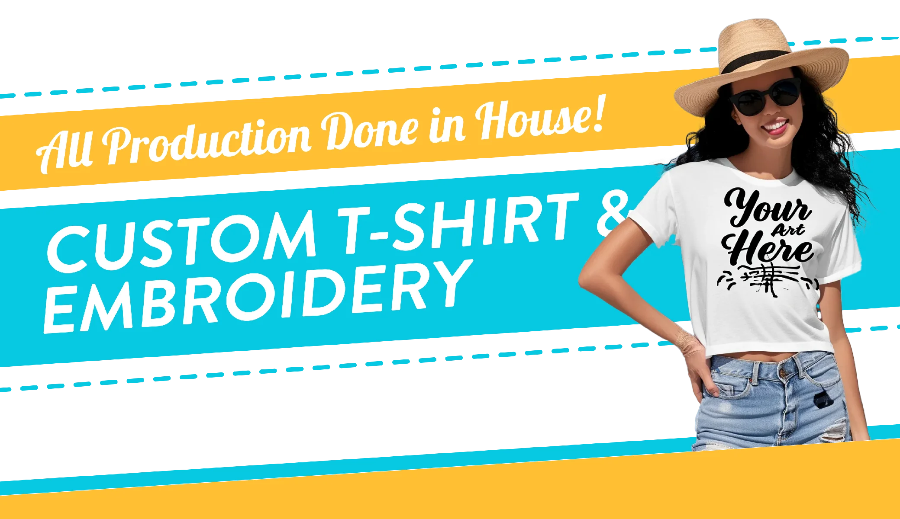

Custom t-shirts have become a popular way to express one's individuality, promote a business or event, or simply create a unique fashion statement. However, many people may wonder about the cost of getting custom t-shirts made. The answer to this question can vary depending on several factors, such as the quantity of shirts ordered, the type of printing method used, and the complexity of the design. When it comes to custom t-shirts, the cost can range from a few dollars per shirt to upwards of $50 or more. The price per shirt typically decreases as the quantity ordered increases, making it more cost-effective to order in bulk. Additionally, the type of printing method used can affect the cost, with screen printing being a more affordable option for larger orders and direct-to-garment printing being better suited for smaller orders or more complex designs. Overall, understanding the various factors that impact the cost of custom t-shirts can help individuals and businesses make informed decisions when it comes to creating their own unique garments.

<h2>Factors Influencing Custom T-Shirt Cost</h2>

When it comes to custom t-shirts, the cost can vary depending on a number of factors. Here are some of the key factors that can influence the cost of custom t-shirts.

<h3>Material Quality</h3>

One of the biggest factors that can influence the cost of custom t-shirts is the quality of the material used. Higher quality materials tend to be more expensive, but they also tend to last longer and look better. Some common materials used for custom t-shirts include cotton, polyester, and blends of the two.

<h3>Quantity of Order</h3>

Another factor that can impact the cost of custom t-shirts is the quantity of the order. Generally speaking, the more t-shirts you order, the lower the cost per shirt will be. This is because the printing process becomes more efficient as the quantity increases.

<h3>Printing Techniques</h3>

The printing technique used can also affect the cost of custom t-shirts. Some techniques, such as screen printing, are more cost-effective for larger orders, while others, such as direct-to-garment printing, may be better suited for smaller orders or more complex designs.

<h3>Custom Design Complexity</h3>

The complexity of the custom design can also play a role in the cost of custom t-shirts. Designs that require more colors, intricate details, or special effects may require more time and resources to create, which can increase the overall cost.  Overall, when it comes to custom t-shirts, there are a variety of factors that can influence the cost. By understanding these factors, you can make more informed decisions about your custom t-shirt orders and ensure that you are getting the best value for your money.

<h2>Price Breakdown</h2>
<h3>Per Item Cost</h3>

The cost of custom t-shirts can vary depending on the design, the number of colors used, and the quality of the shirt. Typically, the per-item cost of a custom t-shirt ranges from $10 to $25. However, some companies may charge more for complex designs or high-quality shirts. It is important to shop around and compare prices before choosing a company to work with.

<h3>Bulk Pricing Advantages</h3>

Many custom t-shirt companies offer bulk pricing discounts. This means that the more shirts you order, the lower the per-item cost will be. Bulk pricing advantages can be significant, with prices dropping to as low as $5 per shirt for large orders. If you are ordering custom t-shirts for a team, event, or business, it is worth considering ordering in bulk to take advantage of these discounts.

<h3>Additional Fees</h3>

In addition to the per-item cost, there may be additional fees to consider when ordering custom t-shirts. Some companies charge set-up fees for creating the design, while others may charge extra for rush orders or shipping. It is important to ask about any additional fees upfront to avoid surprises when it comes time to pay. Overall, the cost of getting custom t-shirts can vary depending on a number of factors. By understanding the per-item cost, bulk pricing advantages, and additional fees, you can make an informed decision when it comes to ordering custom t-shirts for your team, event, or business.

<h2>Tips for Reducing Costs</h2>

When it comes to getting custom t-shirts, there are a few tips that can help you reduce costs without sacrificing quality. Here are some ways to save money:

<h3>1. Order in Bulk</h3>

One of the easiest ways to save money on custom t-shirts is to order in bulk. Many t-shirt printing companies offer discounts for larger orders, so the more you order, the lower the price per shirt will be. If you have a large group or event that requires custom t-shirts, consider ordering in bulk to save money.

<h3>2. Choose Simple Designs</h3>

The more complex your design, the more expensive it will be to print. To reduce costs, consider choosing a simple design that uses fewer colors. This will not only be cheaper to print, but it will also be easier to read and understand.

<h3>3. Use Standard Colors</h3>

Using standard colors can also help reduce costs. Custom colors require more time and effort to create, which can drive up the price of your t-shirts. If you can use standard colors, you can save money on your order.

<h3>4. Choose the Right Printing Method</h3>

There are several printing methods available for custom t-shirts, each with its own pros and cons. Some printing methods are more expensive than others, so it's important to choose the right one for your needs. Screen printing is a popular and cost-effective option for larger orders, while digital printing is better suited for smaller orders. By following these tips, you can save money on your custom t-shirt order without sacrificing quality. 

<h2>Frequently Asked Questions</h2>
<h3>What factors influence the cost of custom t-shirt production?</h3>

The cost of custom t-shirt production is influenced by various factors, including the type of fabric used, the printing method, the number of colors in the design, and the quantity ordered. Additionally, the complexity of the design and the number of locations where the design is printed can also impact the cost.

<h3>What is the average price range for ordering custom t-shirts in bulk?</h3>

The average price range for ordering custom t-shirts in bulk varies depending on the number of shirts ordered and the complexity of the design. Generally, the more shirts ordered, the lower the price per unit. Basic designs with one or two colors can cost as low as $5 per shirt, while more complex designs with multiple colors and printing locations can cost upwards of $20 per shirt.

<h3>How does the quantity of t-shirts ordered affect the price per unit?</h3>

The quantity of t-shirts ordered has a significant impact on the price per unit. Generally, the more shirts ordered, the lower the price per unit. For example, ordering 100 t-shirts may cost $10 per shirt, while ordering 500 t-shirts may cost $6 per shirt.

<h3>What additional costs are associated with custom t-shirt printing?</h3>

Additional costs associated with custom t-shirt printing include setup fees, shipping costs, and rush fees for expedited orders. Additionally, if the design requires special inks or printing techniques, there may be additional charges.

<h3>How do design complexities impact the pricing of custom t-shirts?</h3>

Design complexities, such as the number of colors in the design and the number of printing locations, can impact the pricing of custom t-shirts. Designs with more colors and printing locations require more time and resources to produce, which can result in higher costs.

<h3>What are the typical charges for professional t-shirt design services?</h3>

The typical charges for professional t-shirt design services vary depending on the complexity of the design and the experience of the designer. Basic designs may cost as low as $50, while more complex designs can cost upwards of $500. It's important to research and compare different designers to find one that fits your budget and design needs.
