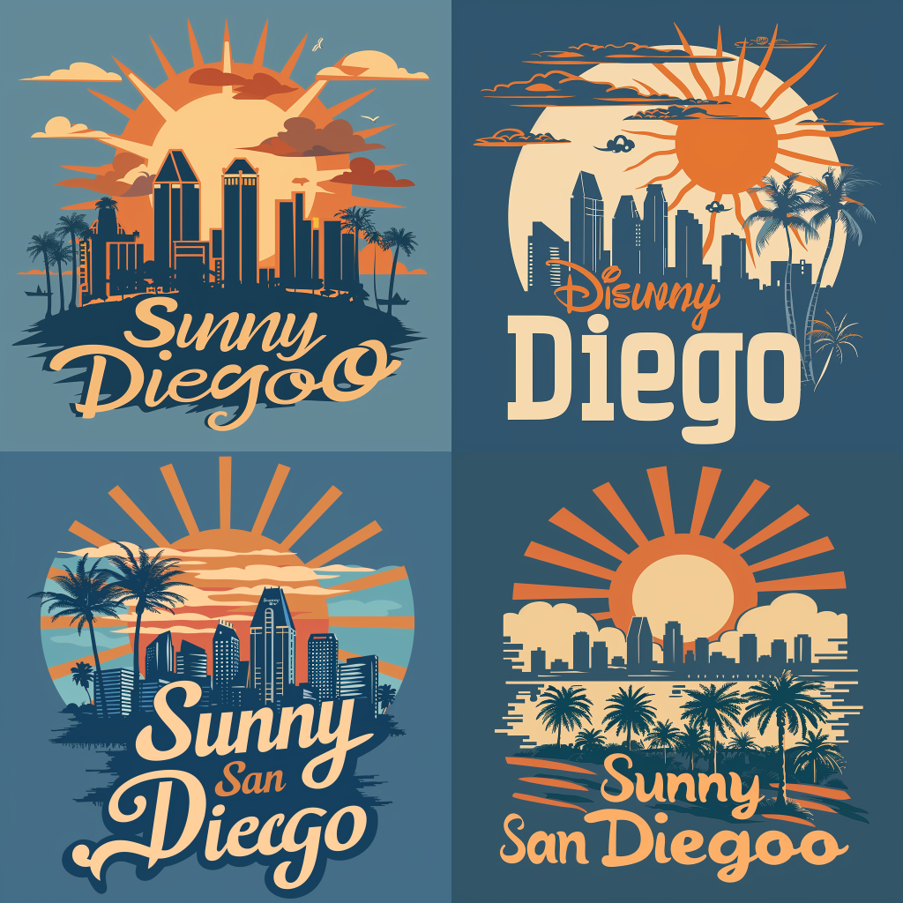

Custom t-shirts have become an increasingly popular way to showcase personal style and create one-of-a-kind apparel. While the use of AI in art creation can be a topic of debate, leveraging your unique taste and perspective alongside AI technology can significantly enhance the design process. This comprehensive guide is designed to help beginners harness the power of AI tools for effective and creative t-shirt design, ensuring you produce high-quality, personalized garments.

Understanding AI in Custom T-shirt Design
-----------------------------------------

AI has been at the forefront of technological advancements, with the potential to revolutionize various industries, much like electricity and the automobile did in their time. In the realm of t-shirt design, AI serves as a powerful ideation tool for crafting unique and personalized designs. By leveraging AI, designers can generate innovative design ideas, suggest harmonious color schemes, and create intricate patterns that would be difficult to conceive manually.

Selecting an AI Image Generator
-------------------------------

There are numerous AI tools available, more popping up daily, here are some quick options: **Free:**

*   **[Canva](https://www.canva.com/):** It’s user-friendly and perfect for beginners.
*   **[Chat GPT](https://chatgpt.com/) (7-day trial period):** ChatGPT is probably the most popular AI and offers a free 7-day trial for 4.0, which you’ll need for image generation.

**Paid:**

*   **[Midjourney](https://www.midjourney.com/):** specializes in generating high-quality, creative visuals. It’s excellent for more advanced users looking for detailed and unique designs.
*   **[Adobe Photoshop and Illustrator](https://www.adobe.com/):**Adobe’s AI-powered features in Photoshop and Illustrator allow for sophisticated design design manipulation, making them ideal for professional-level designs or those willing to get their hands dirty.

Step-by-Step Guide to Designing a Custom T-Shirt with AI
--------------------------------------------------------

### 1\. The Prompt

**Creating a good Prompt:** The key to getting the best results from AI is to provide clear and detailed prompts. For example, if you’re using an AI tool to generate artwork, describe the style, colors, and elements you want to include. For instance:

> “Create a retro-style t-shirt design with vibrant colors and a summer theme.”

### 2\. Make it Personal

Those are interesting but I want to make something that speaks to my own sense of individuality, I want to feature San Diego, where I live and one of my favorite artists: Mary Blair from Disney in the 50's. I’m not even sure what this might look like, but we can use AI’s ability to make connections with seemingly unrelated topics.

> “create a t-shirt that says "Sunny San Diego" with the city skyline and light orange and blue colors, style of Mary Blair”

 **Refinement:** That's nice, but not really what I'm looking for. It doesn't feel "Mary Blair" enough to me. I'm going to nudge more towards Disney and I want to put some palm trees in there.

> create a t-shirt that says "Sunny San Diego" with the city skyline, the sun, palm trees, light orange and blue colors, style of Disney's Mary Blair

 I actually like the the the second option, it has a spelling error, but I can copy one of the good "n"'s. So now I'll tell the AI to create variations based on the version I like and see what it does.  I like the how the city looks in the first option, it reminds me of the iconic Disney logo with the castle in the background. But I do not like the text. I want to take the text from the first option I liked and put it on this one. The will require some editing which I will do in Photoshop. 

### 3\. Mix and Match What You Like

I'm going to use some AI features in photoshop to automatically remove text from the second option. You can find this after making a selection in Edit>Generative Fill... Then you can put in the prompt "Remove Text" (It's prompts all the way down) And isn't this truly the future we were promised years ago. We should be giving explicit instructions to the computer. That's the future we deserve!  Then I use Photoshop to extract the Text out of the first option and put it into the second option fixing the typo in the process.  Finally I add a bit of a drop-shadow to the word San Diego to help blend in with the background better, fix little errors and make some color adjustments. 

Conclusion
----------

Leveraging AI for custom t-shirt design offers numerous benefits, from accelerating the ideation process to enhancing overall creativity. With AI tools, even beginners can effortlessly create professional-quality designs. Key takeaways include the importance of crafting detailed prompts, personalizing AI-generated designs, and refining them with traditional design tools. We encourage beginners to explore these AI tools, as they can unlock new possibilities in t-shirt design. Start designing your custom t-shirt with AI today and unleash your creativity! When you do create that awesome design, have Image On turn it into a reality for you and your friends. Contact Us below!