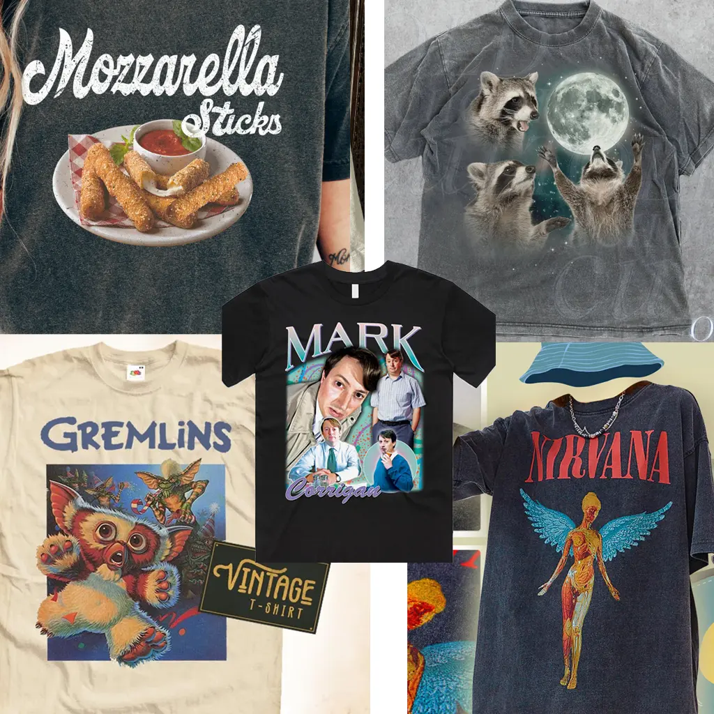
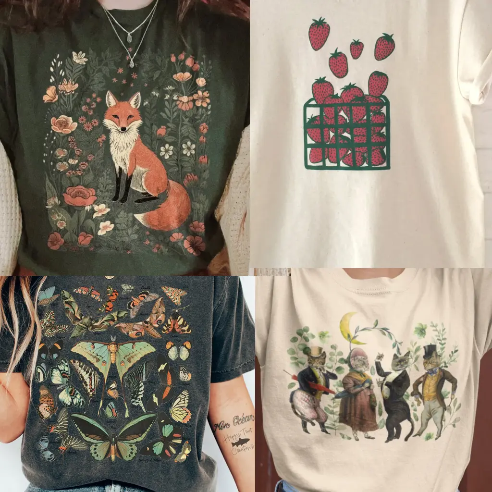
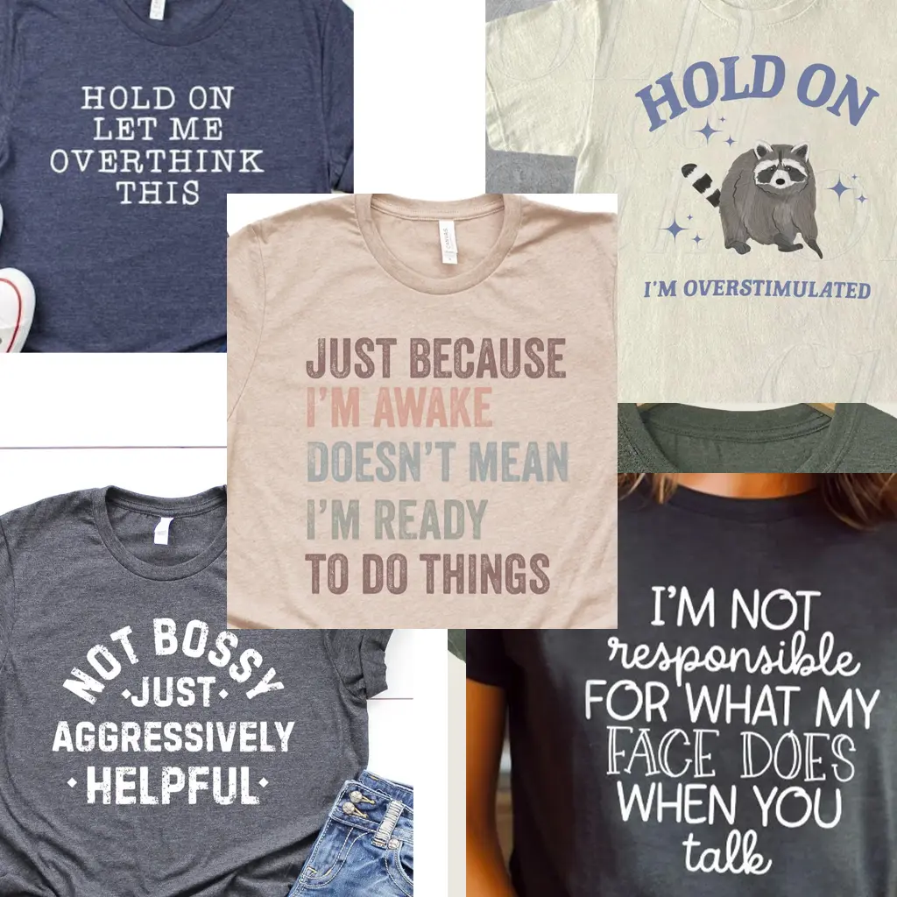
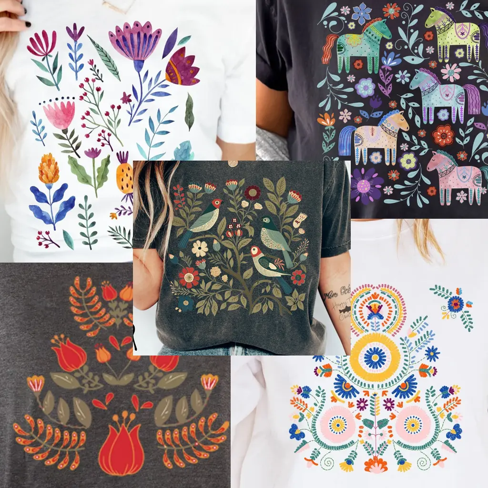
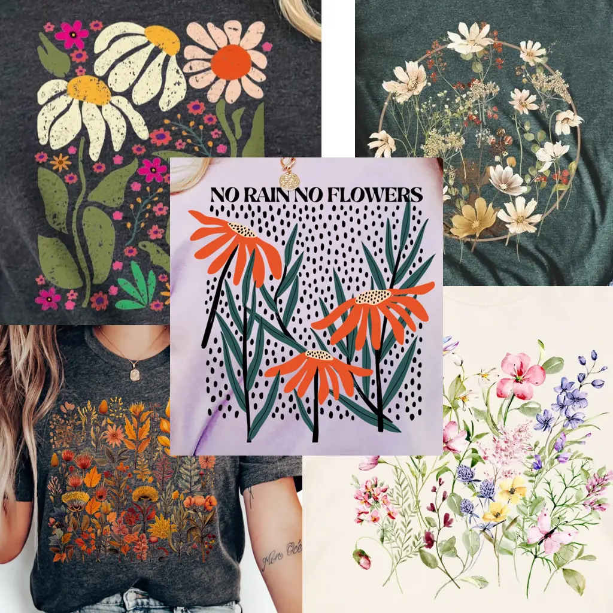

Alright, fashionistas, buckle up because 2024’s custom t-shirt trends are here and they’re taking us on a wild ride through the past! That's right, this year we’re not just wearing our hearts on our sleeves, we’re wearing our nostalgia, anxiety, and a desperate longing to escape modern life on our chests. Let’s dive into the top trends that will make you say, “I wish I was living in any time but now!” The world is rose-tinted and oversized (shirts).

<h2>1. 90's Maxxing</h2>

Ah, the 90s. A simpler time when the internet was dial-up, jeans were baggy, and Tamagotchis were our best friends. This trend is for anyone who wants to relive the glory days of grunge, boy bands, and "Saved by the Bell." Expect t-shirts with neon colors, retro patterns, and enough pop culture references to make even your old beeper vibrate with joy. It’s like time traveling without the awkward middle school dance memories.

<h2>2. Cottagecore</h2>

Cottagecore is for those who fantasize about living in a fairytale cottage, far away from the stress of modern life. Picture this: you, in a meadow, wearing a t-shirt covered in delicate floral prints and pastoral scenes. Meanwhile, your WiFi is non-existent and your biggest worry is whether to bake bread or make jam. Ah, the dream! This trend is your ticket to an imaginary countryside where the only hustle and bustle is the bees buzzing around your bonnet.

<h2>3. Millennial &amp; Zoomer Anxiety</h2>

Raise your hand if you’ve ever felt personally victimized by adulthood. This trend is for you, Millennials and Zoomers. T-shirts with slogans like “Adulting is Overrated” and “Perpetually Tired” capture the essence of our collective freak-out about growing up. It's like therapy, but cheaper and you get a cool shirt out of it. Perfect for those days when you need to remind everyone (including yourself) that nobody has it all figured out—and that’s okay.

<h2>4. Scandi</h2>

Scandi style is back and bringing the 50s with it. Think clean lines, muted colors, and patterns so minimalist they make Marie Kondo look like a hoarder. This trend is for those who appreciate elegance and simplicity, and for anyone who’s ever tried to assemble IKEA furniture and thought, “This could be a lifestyle.” It’s classy, it’s timeless, and it’s the perfect way to say, “I’m sophisticated, but I also enjoy a good meatball.”

<h2>5. Wildflowers</h2>

If Cottagecore is a whole vibe, Wildflowers are its greatest hits album. These t-shirts feature vibrant floral prints that scream, “I frolic in fields in my spare time.” It's a reminder that even in our concrete jungles, there’s always room for a little bit of nature—and maybe a daisy or two. Wildflowers bring a touch of whimsy and a splash of color to our otherwise drab, screen-lit lives.

<h2>Escaping the Present</h2>

Overall, these trends show a clear desire to escape the crushing weight of the present and find solace in the past, or at least in a fantasy version of it. Whether you’re reliving the 90s, dreaming of countryside simplicity, laughing at the absurdity of adulting, embracing Scandinavian minimalism, or getting lost in fields of wildflowers, 2024’s t-shirt trends are here to help you cope with modern life, one ironic shirt at a time. Embrace the irony, wear the nostalgia, and remember: at least we’re all in this mess together.

Wether you chasing the latest trends, or haven't bought a new shirt since the Spice Girls disbanded, Image On can help you with all your custom t-shirt and embroidery needs.

Let us know what you think below!

