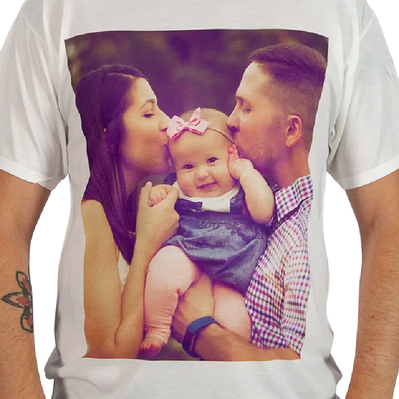
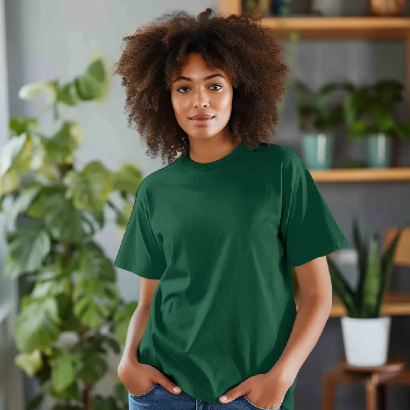

If you're a small business owner looking to sell branded merchandise, direct-to-garment (DTG) printing is a top-notch choice for producing high-quality, full-color artwork on t-shirts quickly and affordably. Here are eight compelling reasons why DTG printing is ideal for small businesses.

1\. Limitless Color Options
---------------------------

DTG printing excels at producing vibrant, full-color designs with intricate details and gradients. Unlike screen printing, which requires separate screens for each color, DTG printing uses digital images, allowing for unlimited color options without added costs. This makes it perfect for complex designs with multiple shades.

2\. Photorealistic Prints
-------------------------

DTG printing is exceptional for replicating photorealistic images. Whether it's a photo taken on your smartphone or a detailed digital design, DTG ensures high-resolution prints with 600 dpi for superior crispness and clarity compared to traditional screen printing.

3\. Ideal for Small Batches
---------------------------

For orders under 24 pieces, DTG printing is a fantastic choice. It offers the flexibility to produce one-off items or small runs quickly and efficiently. The setup process is faster than screen printing, making DTG perfect for last-minute orders or events.

4\. Best Results on 100% Cotton
-------------------------------

DTG printing delivers the best results on 100% cotton garments, ensuring clear and vibrant prints. Cotton retains ink better, producing sharper images. Popular choices include American Apparel Unisex Heavyweight T-Shirt 1301, Gildan® - Ladies Ultra Cotton® 100% US Cotton T-Shirt. 2000L, and Gildan® - Ultra Cotton® 100% US Cotton Tank Top. 2200, known for their superior print quality.

5\. Focus on Your Brand, Not Printing
-------------------------------------

Starting a clothing brand? Let a reputable decorator handle the printing, so you can concentrate on marketing and selling your products. On-demand fulfillment programs allow you to print as orders come in, reducing upfront costs and inventory management.

6\. Profitable Pricing
----------------------

With DTG printing, you can price your t-shirts for a significant profit. For instance, printing a 3001 tee might cost $12 to $14, allowing you to sell it for $25 to $30. This pricing strategy ensures a healthy profit margin without carrying excess inventory.

7\. Start Small, Grow Big
-------------------------

Test the market with a small batch of DTG-printed tees before investing heavily in inventory. This approach lets you gauge demand without significant financial risk. As your business grows, you can scale up your orders accordingly.

At ImageOn we do same day DTG printing on small orders. If you are looking for a [custom t-shirt](https://imageonsd.com/services/custom-t-shirts/) stop by or send us a message below and let us know what you need and if DTG is the right choice.